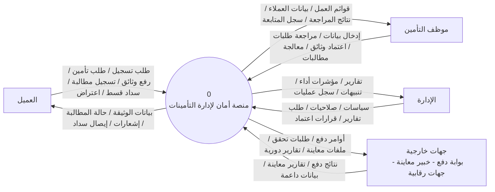
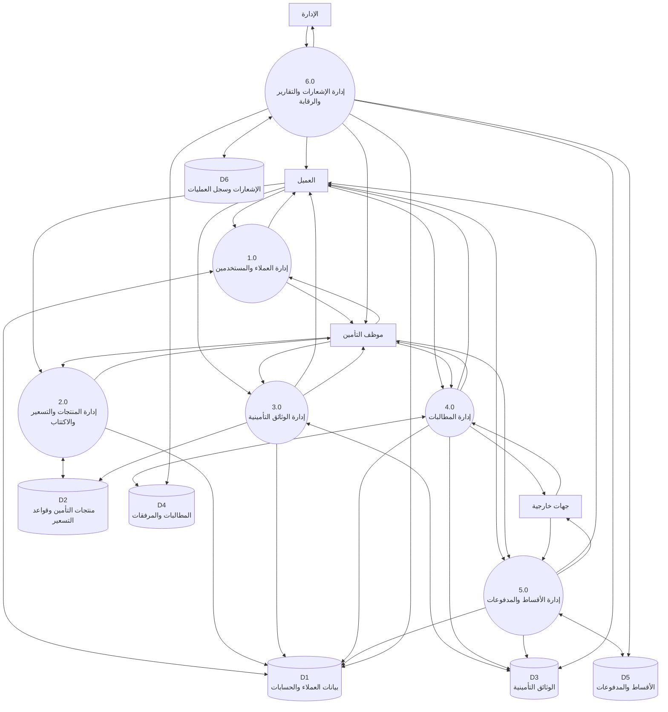
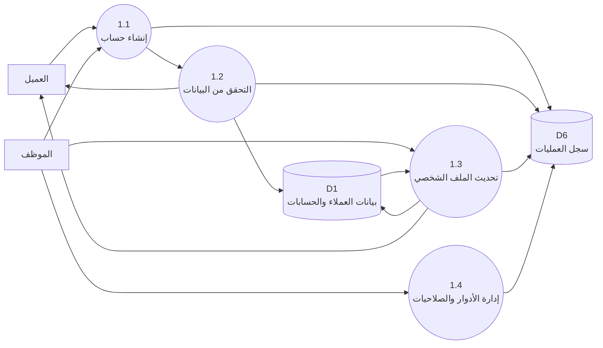
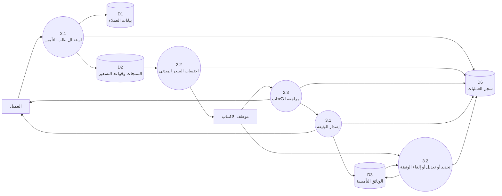
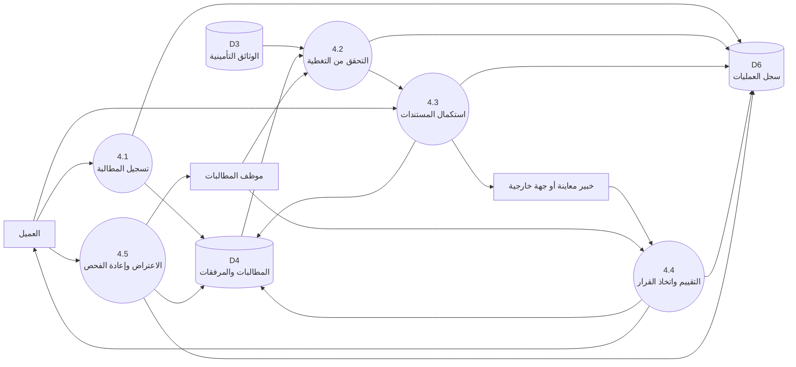
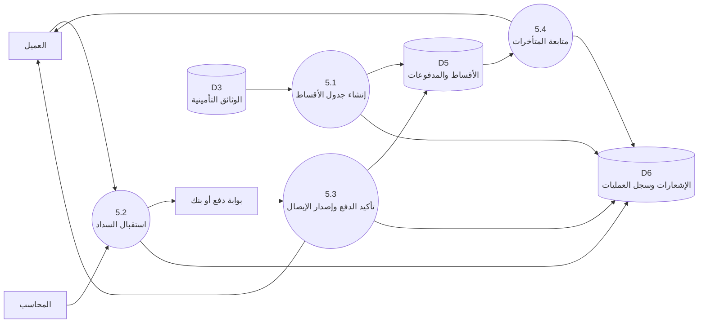
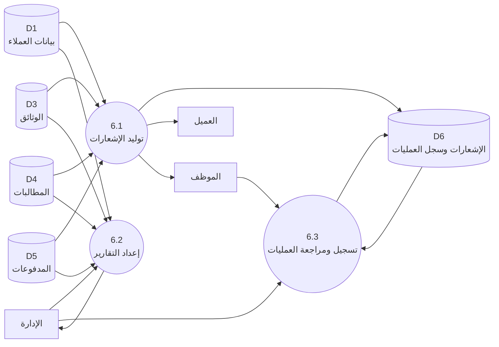

# مخططات تدفق البيانات للفصل الثالث

يحتوي هذا الملف على مخططات تدفق البيانات المقترحة بصيغة `Mermaid`، ويمكن نسخ كل مخطط وتحويله إلى صورة لإدراجه في وثيقة المشروع.

## 1. المخطط البيئي

## 2. المخطط الصفري

## 3. مخطط المستوى الأول للعملية 1.0 إدارة العملاء والمستخدمين

## 4. مخطط المستوى الأول للعملية 2.0 و 3.0 إدارة الاكتتاب والوثائق

## 5. مخطط المستوى الأول للعملية 4.0 إدارة المطالبات

## 6. مخطط المستوى الأول للعملية 5.0 إدارة الأقساط والمدفوعات

## 7. مخطط المستوى الأول للعملية 6.0 الإشعارات والتقارير والرقابة

