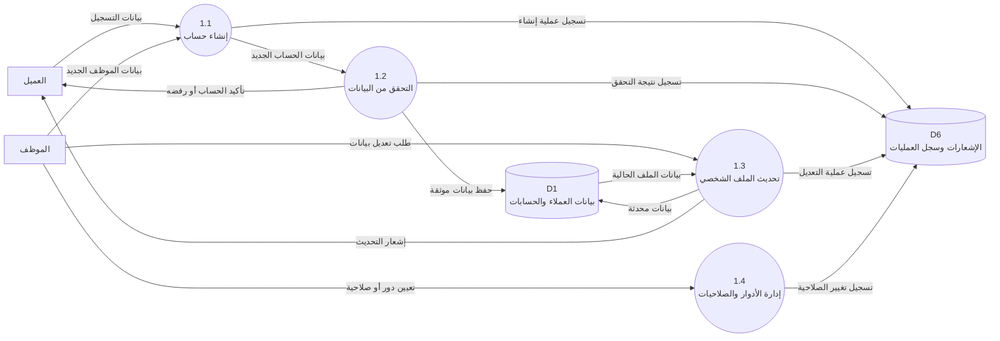
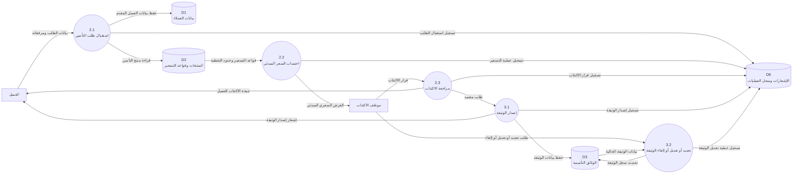
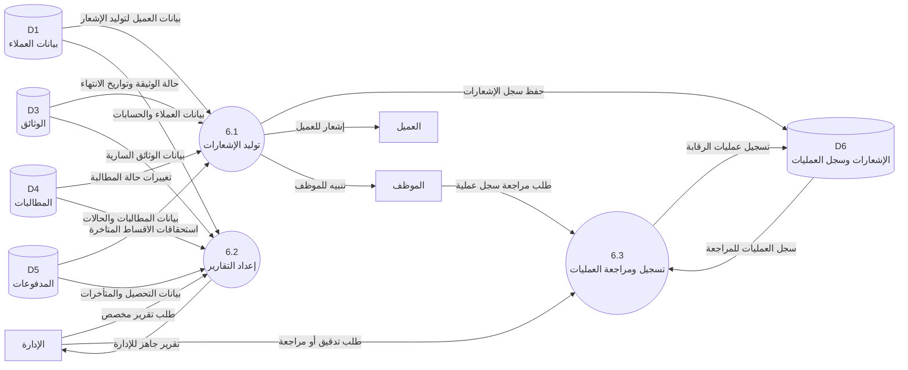
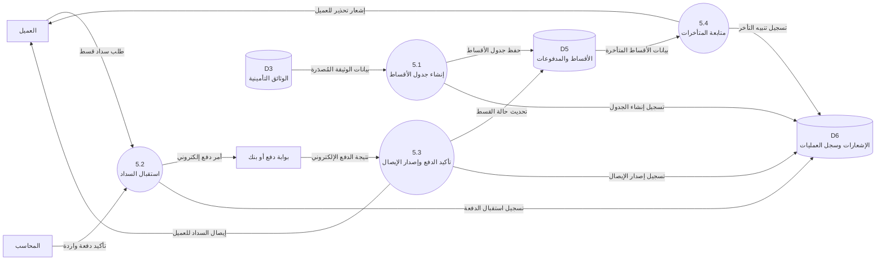

# مخططات تدفق البيانات للفصل الثالث

يحتوي هذا الملف على مخططات تدفق البيانات المقترحة بصيغة `Mermaid`، ويمكن نسخ كل مخطط وتحويله إلى صورة لإدراجه في وثيقة المشروع.

## 1. المخطط البيئي

```mermaid
flowchart LR
    C[العميل]
    E[موظف التأمين]
    M[الإدارة]
    X[جهات خارجية<br/>بوابة دفع - خبير معاينة - جهات رقابية]
    S((0<br/>منصة أمان لإدارة التأمينات))

    C -- طلب تسجيل / طلب تأمين / رفع وثائق / تسجيل مطالبة / سداد قسط / اعتراض --> S
    S -- بيانات الوثيقة / حالة المطالبة / إشعارات / إيصال سداد --> C

    E -- إدخال بيانات / مراجعة طلبات / اعتماد وثائق / مع## 2. المخطط الصفري

```mermaid
flowchart TB
    C[العميل]
    E[موظف التأمين]
    M[الإدارة]
    X[جهات خارجية]

    P1((1.0<br/>إدارة العملاء والمستخدمين))
    P2((2.0<br/>إدارة المنتجات والتسعير والاكتتاب))
    P3((3.0<br/>إدارة الوثائق التأمينية))
    P4((4.0<br/>إدارة المطالبات))
    P5((5.0<br/>إدارة الأقساط والمدفوعات))
    P6((6.0<br/>إدارة الإشعارات والتقارير والرقابة))

    D1[(D1<br/>بيانات العملاء والحسابات)]
    D2[(D2<br/>منتجات التأمين وقواعد التسعير)]
    D3[(D3<br/>الوثائق التأمينية)]
    D4[(D4<br/>المطالبات والمرفقات)]
    D5[(D5<br/>الأقساط والمدفوعات)]
    D6[(D6<br/>الإشعارات وسجل العمليات)]

    C -- بيانات التسجيل --> P1
    C -- طلب تأمين جديد --> P2
    C -- طلب تجديد أو تعديل وثيقة --> P3
    C -- تسجيل مطالبة --> P4
    C -- سداد قسط --> P5
    P1 -- تأكيد الحساب --> C
    P3 -- بيانات الوثيقة --> C
    P4 -- قرار المطالبة --> C
    P5 -- إيصال السداد --> C
    P6 -- إشعارات وتنبيهات --> C

    E -- بيانات موظف --> P1
    E -- مراجعة منتج وتسعير --> P2
    E -- استعراض وثائق --> P3
    E -- معالجة مطالبة --> P4
    E -- متابعة مدفوعات --> P5
    P1 -- صلاحيات وقوائم عمل --> E
    P2 -- نتيجة التسعير --> E
    P3 -- بيانات الوثيقة --> E
    P4 -- قائمة المطالبات --> E
    P6 -- تنبيهات وإشعارات --> E

    M -- إدارة أدوار ومستخدمين --> P1
    M -- اعتماد منتجات وسياسات تسعير --> P2
    M -- طلب تقارير --> P6
    P6 -- تقارير ومؤشرات أداء --> M

    X -- نتائج دفع إلكتروني --> P4
    X -- نتائج دفع إلكتروني --> P5
    P4 -- طلب معاينة أو تحقق --> X
    P5 -- أمر دفع إلكتروني --> X

    P1 <-- قراءة وتحديث بيانات العملاء --> D1
    P2 <-- قراءة وتحديث منتجات وقواعد التسعير --> D2
    P2 -- تسجيل بيانات العميل المقدِّم --> D1
    P3 <-- قراءة وإصدار وتحديث الوثائق --> D3
    P3 -- قراءة بيانات العميل --> D1
    P3 -- قراءة نوع التأمين والتسعير --> D2
    P4 <-- تسجيل وتحديث المطالبات --> D4
    P4 -- التحقق من الوثيقة السارية --> D3
    P4 -- قراءة بيانات العميل --> D1
    P5 <-- إنشاء وتحديث الأقساط والدفعات --> D5
    P5 -- قراءة بيانات الوثيقة --> D3
    P5 -- قراءة بيانات العميل --> D1
    P6 <-- قراءة وحفظ الإشعارات وسجل العمليات --> D6
    P6 -- قراءة بيانات العملاء --> D1
    P6 -- قراءة بيانات الوثائق --> D3
    P6 -- قراءة بيانات المطالبات --> D4
    P6 -- قراءة بيانات المدفوعات --> D5
```

## 3. مخطط المستوى الأول للعملية 1.0 إدارة العملاء والمستخدمين



## 4. مخطط المستوى الأول للعملية 2.0 و 3.0 إدارة الاكتتاب والوثائق



## 5. مخطط المستوى الأول للعملية 4.0 إدارة المطالبات

```mermaid
flowchart LR
    C[العميل]
    E[موظف المطالبات]
    X[خبير معاينة أو جهة خارجية]
    D3[(D3<br/>الوثائق التأمينية)]
    D4[(D4<br/>المطالبات والمرفقات)]
    D6[(D6<br/>الإشعارات وسجل العمليات)]

    P41((4.1<br/>تسجيل المطالبة))
    P42((4.2<br/>التحقق من التغطية))
    P43((4.3<br/>استكمال المستندات))
    P44((4.4<br/>التقييم واتخاذ القرار))
    P45((4.5<br/>الاعتراض وإعادة الفحص))

    C -- بيانات الحادث والمستندات الأولية --> P41
    P41 -- حفظ بيانات المطالبة الجديدة --> D4
    D3 -- بيانات الوثيقة السارية --> P42
    D4 -- بيانات المطالبة المسجلة --> P42
    E -- مراجعة شروط ا�
(5.3<br/>تأكيد الدفع وإصدار الإيصال))
    P54((5.4<br/>متابعة المتأخرات))

    D3 -- بيانات الوثيقة المُصدَرة --> P51
    P51 -- حفظ جدول الأقساط --> D5
    C -- طلب سداد قسط --> P52
    A -- تأكيد دفعة واردة --> P52
    P52 -- أمر دفع إلكتروني --> X
    X -- نتيجة الدفع الإلكتروني --> P53
    P53 -- تحديث حالة القسط --> D5
    P53 -- إيصال السداد للعميل --> C
    D5 -- بيانات الأقساط المتأخرة --> P54
    P54 -- تسجيل تنبيه التأخر --> D6
    P54 -- إشعار تحذير للعميل --> C
    P51 -- تسجيل إنشاء الجدول --> D6
    P52 -- تسجيل استقبال الدفعة --> D6
    P53 -- تسجيل إصدار الإيصال --> D6
```

## 7. مخطط المستوى الأول للعملية 6.0 الإشعارات والتقارير والرقابة



> P44
    E --> P44
    P44 --> D4
    P44 --> C
    C --> P45 --> E
    P45 --> D4
    P41 --> D6
    P42 --> D6
    P43 --> D6
    P44 --> D6
    P45 --> D6
```

## 6. مخطط المستوى الأول للعملية 5.0 إدارة الأقساط والمدفوعات



## 7. مخطط المستوى الأول للعملية 6.0 الإشعارات والتقارير والرقابة

```mermaid
flowchart LR
    M[الإدارة]
    E[الموظف]
    C[العميل]
    D1[(D1<br/>بيانات العملاء)]
    D3[(D3<br/>الوثائق)]
    D4[(D4<br/>المطالبات)]
    D5[(D5<br/>المدفوعات)]
    D6[(D6<br/>الإشعارات وسجل العمليات)]

    P61((6.1<br/>توليد الإشعارات))
    P62((6.2<br/>إعداد التقارير))
    P63((6.3<br/>تسجيل ومراجعة العمليات))

    D1 -- بيانات العميل لتوليد الإشعار --> P61
    D3 -- حالة الوثيقة وتواريخ الانتهاء --> P61
    D4 -- تغييرات حالة المطالبة --> P61
    D5 -- استحقاقات الأقساط المتأخرة --> P61
    P61 -- حفظ سجل الإشعارات --> D6
    P61 -- إشعار للعميل --> C
    P61 -- تنبيه للموظف --> E

    M -- طلب تقرير مخصص --> P62
    D1 -- بيانات العملاء والحسابات --> P62
    D3 -- بيانات الوثائق السارية --> P62
    D4 -- بيانات المطالبات والحالات --> P62
    D5 -- بيانات التحصيل والمتأخرات --> P62
    P62 -- تقرير جاهز للإدارة --> M

    E -- طلب مراجعة سجل عملية --> P63
    M -- طلب تدقيق أو مراجعة --> P63
    P63 -- تسجيل عمليات الرقابة --> D6
    D6 -- سجل العمليات للمراجعة --> P63
