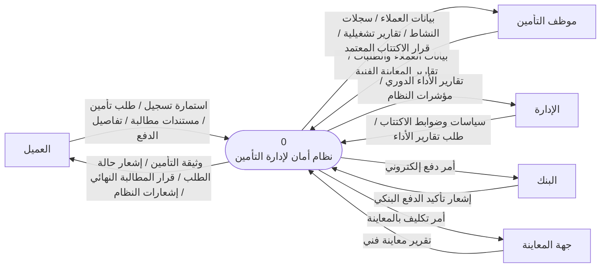
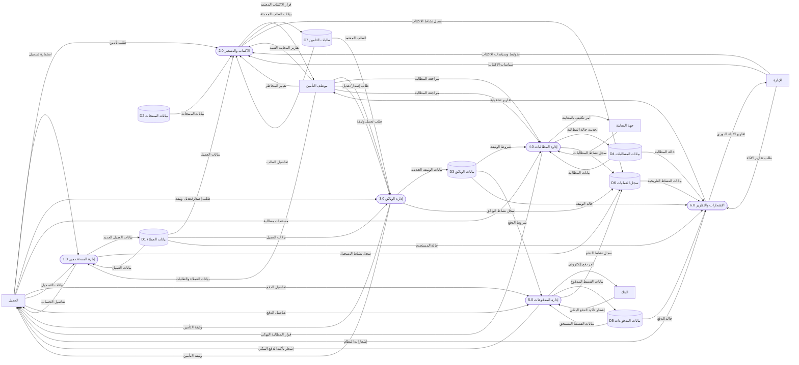
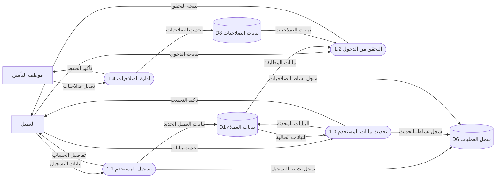
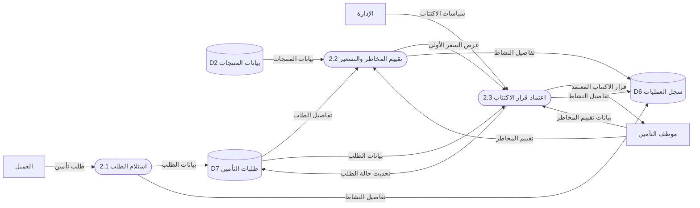
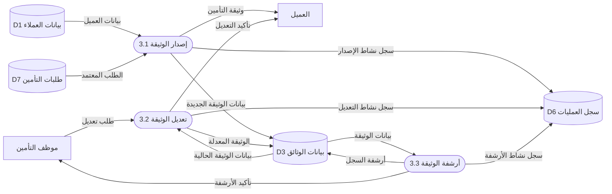
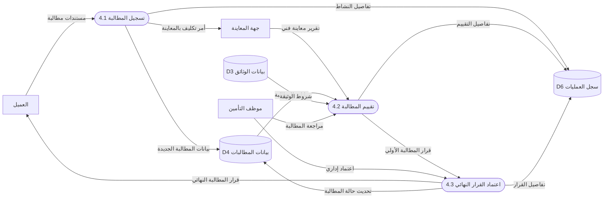
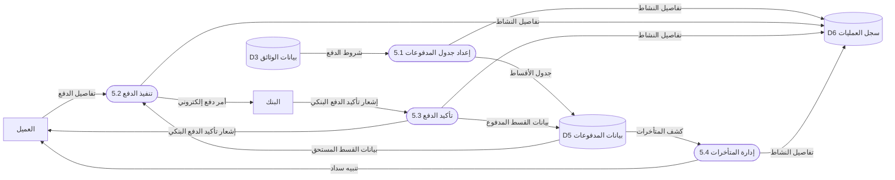
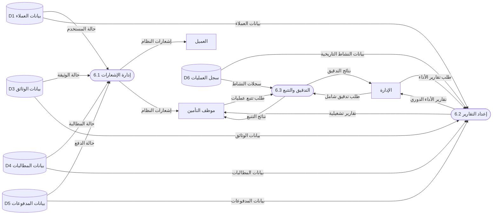

أكيد، هذه نسخة نهائية موحّدة بصياغة أكاديمية مختصرة وجاهزة للنسخ في التقرير:

---

# مخططات تدفق البيانات لنظام أمان لإدارة التأمين

توضح مخططات تدفق البيانات الخاصة بنظام **أمان لإدارة التأمين** حدود النظام، والكيانات الخارجية المتعاملة معه، والعمليات الرئيسية، ومخازن البيانات، مع الالتزام بمبادئ **Yourdon & DeMarco** ومتطلبات **Balancing** بين المستويات المختلفة.

## 1) المخطط البيئي (Context Diagram)

يبيّن هذا المخطط حدود النظام وعلاقته بالكيانات الخارجية، وهي: العميل، موظف التأمين، الإدارة، البنك، وجهة المعاينة.
يتبادل النظام مع هذه الكيانات البيانات الأساسية مثل استمارات التسجيل، طلبات التأمين، مستندات المطالبات، تفاصيل الدفع، تقارير المعاينة، تقارير الأداء، وأوامر الدفع والتأكيدات البنكية.

## 2) المخطط الصفري (Level 0 DFD)

يُفكّك النظام إلى ست عمليات رئيسية: إدارة المستخدمين، الاكتتاب والتسعير، إدارة الوثائق، إدارة المطالبات، إدارة المدفوعات، والإشعارات والتقارير.
ترتبط هذه العمليات بالكيانات الخارجية وبمخازن البيانات بطريقة متوازنة، بحيث تمثل كل عملية جزءًا محددًا من وظائف النظام، مع استخدام سجل العمليات لتوثيق الأنشطة التشغيلية وإتاحة بياناته لعملية التقارير والتدقيق.

## 3) المستوى الأول لعملية إدارة المستخدمين (1.0)

تتضمن هذه العملية تسجيل المستخدمين، والتحقق من الدخول، وتحديث بيانات الحساب، وإدارة الصلاحيات.
تعتمد العملية على بيانات العملاء وسجل العمليات لضمان حفظ بيانات المستخدمين وتوثيق الأنشطة المرتبطة بهم.

## 4) المستوى الأول لعملية الاكتتاب والتسعير (2.0)

تتولى هذه العملية استلام طلب التأمين، تسعير الطلب، واعتماد قرار الاكتتاب النهائي.
تستند العملية إلى بيانات المنتجات، وطلبات التأمين، وتقييم المخاطر المقدم من موظف التأمين، إضافة إلى السياسات المعتمدة من الإدارة.

## 5) المستوى الأول لعملية إدارة الوثائق (3.0)

تختص هذه العملية بإصدار الوثائق التأمينية وتعديلها عند الحاجة.
تعتمد على بيانات العملاء وطلبات التأمين المعتمدة، ثم تقوم بتحديث بيانات الوثائق وإصدار النسخة النهائية للعميل.

## 6) المستوى الأول لعملية إدارة المطالبات (4.0)

تشمل هذه العملية تسجيل المطالبة، تقييمها، واعتماد القرار النهائي بشأنها.
كما تتعامل مع جهة المعاينة للحصول على التقرير الفني، وتتيح للعميل تقديم الاعتراض عند الحاجة، مع تحديث حالة المطالبة وحفظها في النظام.

## 7) المستوى الأول لعملية إدارة المدفوعات (5.0)

تقوم هذه العملية بإعداد المدفوعات وتنفيذها وتأكيدها مع البنك، إضافة إلى تسجيل حالة الدفع في النظام.
وتعتمد على بيانات الوثيقة، وبيانات القسط المستحق، ونتائج التأكيد البنكي لضمان دقة العمليات المالية.

## 8) المستوى الأول لعملية الإشعارات والتقارير (6.0)

تتولى هذه العملية إدارة الإشعارات، إعداد التقارير، وتنفيذ التدقيق والتتبع.
وتعتمد على بيانات العملاء والوثائق والمطالبات والمدفوعات وسجل العمليات، بهدف توفير تقارير تشغيلية وتقارير أداء دورية ونتائج تدقيق دقيقة للإدارة والموظفين.

## خلاصة

تعكس هذه المخططات البنية الوظيفية للنظام بصورة متكاملة ومتوازنة، وتوضح انتقال البيانات بين الكيانات الخارجية والعمليات الداخلية ومخازن البيانات بشكل منظم ومتسق، بما يدعم الفهم التحليلي للنظام ويسهّل مرحلة التصميم والتنفيذ لاحقًا.

هذه هي **النسخة النهائية الموحدة الكاملة** لجميع المخططات، بصياغة متسقة ومترابطة بين المستويات:

---

# 1) المخطط البيئي (Context Diagram)

---

# 2) المخطط الصفري (Level 0 DFD)

---

# 3) المستوى الأول لعملية (1.0) إدارة المستخدمين

---

# 4) المستوى الأول لعملية (2.0) الاكتتاب والتسعير

---

# 5) المستوى الأول لعملية (3.0) إدارة الوثائق

---

# 6) المستوى الأول لعملية (4.0) إدارة المطالبات

---

# 7) المستوى الأول لعملية (5.0) إدارة المدفوعات

---

# 8) المستوى الأول لعملية (6.0) الإشعارات والتقارير

