# مخططات تدفق البيانات لنظام أمان لإدارة التأمين

توضح مخططات تدفق البيانات الخاصة بنظام **أمان لإدارة التأمين** حدود النظام، والكيانات الخارجية المتعاملة معه، والعمليات الرئيسة، ومخازن البيانات. وتم ترتيب عمليات المستوى الصفري حسب التسلسل المنطقي للعمل داخل النظام: تبدأ بإدارة العملاء والحسابات، ثم تعريف منتجات التأمين وقواعد التسعير، ثم استقبال طلبات التأمين، ثم الاكتتاب والتسعير، وبعدها الوثائق والمطالبات والمدفوعات والإشعارات والتقارير.

## 1) المخطط البيئي (Context Diagram)

يبيّن هذا المخطط حدود النظام وعلاقته بالكيانات الخارجية، وهي: العميل، موظف التأمين، الإدارة، وجهة المعاينة. ويتبادل النظام مع هذه الكيانات بيانات التسجيل، طلبات التأمين، بيانات الوثائق، بيانات المطالبات، تفاصيل الدفع، تقارير المعاينة، الإشعارات، وتقارير الأداء.

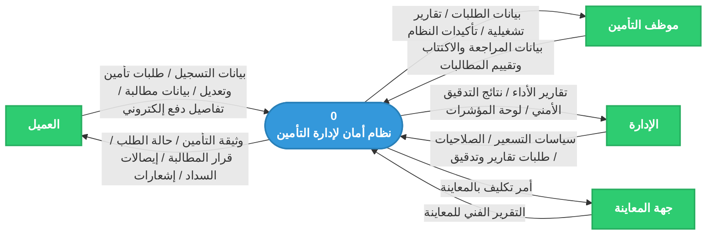

## 2) المخطط الصفري المعتمد (Level 0 DFD)

هذه هي النسخة المعتمدة للمخطط الصفري بعد إعادة الترتيب. تم فصل إدارة منتجات التأمين وقواعد التسعير عن طلبات التأمين، كما تم فصل طلبات التأمين عن الاكتتاب والتسعير حتى تظهر كل دورة عمل رئيسة بوضوح.

```mermaid
flowchart TB
    C["العميل"]
    E["موظف التأمين"]
    M["الإدارة"]
    X["جهة المعاينة"]

    P1(["1.0 إدارة العملاء والحسابات"])
    P2(["2.0 إدارة منتجات التأمين والتسعير"])
    P3(["3.0 إدارة طلبات التأمين"])
    P4(["4.0 إدارة الاكتتاب والتسعير"])
    P5(["5.0 إدارة الوثائق التأمينية"])
    P6(["6.0 إدارة المطالبات التأمينية"])
    P7(["7.0 إدارة الأقساط والمدفوعات"])
    P8(["8.0 إدارة الإشعارات والتواصل"])
    P9(["9.0 إدارة التقارير والتدقيق"])

    %% ترتيب العمليات لمنع التداخل البصري (Grid Layout)
    P1 ~~~ P2 ~~~ P3
    P4 ~~~ P5 ~~~ P6
    P7 ~~~ P8 ~~~ P9

    D1[("D1 بيانات العملاء")]
    D2[("D2 بيانات المنتجات وقواعد التسعير")]
    D3[("D3 بيانات الوثائق وملاحقها")]
    D4[("D4 بيانات المطالبات والاعتراضات")]
    D5[("D5 بيانات الأقساط والمدفوعات")]
    D6[("D6 سجل التدقيق والعمليات")]
    D7[("D7 طلبات التأمين")]
    D8[("D8 سجل الأدوار والصلاحيات")]

    C -->|"بيانات التسجيل والدخول"| P1
    M -->|"ضوابط المستخدمين والصلاحيات"| P1
    P1 -->|"بيانات الحساب الآمنة"| C
    P1 -->|"تأكيد الإجراء"| M

    M -->|"بيانات المجالات والأنواع وقواعد التسعير"| P2
    E -->|"تحديثات المنتجات والتغطيات"| P2
    P2 -->|"قائمة المنتجات والتغطيات المتاحة"| C
    P2 -->|"تأكيد تحديث المنتجات"| M

    C -->|"طلب تأمين وبيانات محل التأمين"| P3
    D2 -->|"أنواع التأمين ومتطلبات المستندات"| P3
    P3 -->|"حالة استلام الطلب"| C
    P3 -->|"طلب جاهز للمراجعة"| E

    E -->|"تقييم المخاطر وبيانات المراجعة"| P4
    M -->|"سياسات الاكتتاب وحدود الاعتماد"| P4
    P4 -->|"قرار الاكتتاب والتسعير النهائي"| E
    P4 -->|"حالة الطلب والسعر المعتمد"| C

    C -->|"طلب تعديل / تجديد / إلغاء وثيقة"| P5
    E -->|"إصدار ومراجعة الوثائق والملاحق"| P5
    D5 -->|"حالة السداد المعتمدة"| P5
    P5 -->|"وثيقة التأمين السارية"| C
    P5 -->|"تأكيد الإجراء"| E

    C -->|"بيانات المطالبة ومرفقاتها"| P6
    E -->|"بيانات مراجعة المطالبة"| P6
    P6 -->|"طلب معاينة"| X
    X -->|"تقرير المعاينة"| P6
    P6 -->|"القرار النهائي / نتيجة الاعتراض"| C

    C -->|"تفاصيل الدفع الإلكتروني / البنكي"| P7
    P7 -->|"إيصال السداد وحالة القسط"| C

    P8 -->|"إشعارات النظام"| C
    P8 -->|"تنبيهات تشغيلية"| E

    M -->|"طلبات التقارير والتدقيق"| P9
    E -->|"طلبات التقارير التشغيلية"| P9
    P9 -->|"تقارير الأداء ونتائج التدقيق"| M
    P9 -->|"تقارير تشغيلية"| E

    P1 -->|"بيانات العملاء المحدثة"| D1
    D1 -->|"بيانات العملاء"| P1
    P1 -->|"بيانات الصلاحيات المحدثة"| D8
    D8 -->|"بيانات الصلاحيات"| P1

    P2 -->|"بيانات المنتجات والقواعد المحدثة"| D2
    D2 -->|"بيانات المنتجات وقواعد التسعير"| P2

    D1 -->|"بيانات العميل"| P3
    P3 -->|"بيانات طلب التأمين"| D7
    D7 -->|"بيانات الطلب"| P3

    D2 -->|"قواعد التسعير والتغطيات"| P4
    D7 -->|"بيانات طلب التأمين"| P4
    P4 -->|"حالة الطلب والسعر النهائي"| D7

    D1 -->|"بيانات العميل"| P5
    D7 -->|"الطلب المعتمد"| P5
    P5 -->|"بيانات الوثيقة"| D3

    D3 -->|"بيانات الوثيقة"| P6
    D4 -->|"بيانات المطالبة"| P6
    P6 -->|"بيانات المطالبة المحدثة"| D4

    D3 -->|"شروط الدفع"| P7
    D5 -->|"بيانات الاستحقاق"| P7
    P7 -->|"بيانات السداد المحدثة"| D5

    D1 -->|"بيانات العملاء"| P8
    D3 -->|"حالات الوثائق"| P8
    D4 -->|"حالات المطالبات"| P8
    D5 -->|"حالات المدفوعات"| P8

    P1 -->|"سجلات نشاط الحسابات"| D6
    P2 -->|"سجلات نشاط المنتجات"| D6
    P3 -->|"سجلات نشاط الطلبات"| D6
    P4 -->|"سجلات نشاط الاكتتاب"| D6
    P5 -->|"سجلات نشاط الوثائق"| D6
    P6 -->|"سجلات نشاط المطالبات"| D6
    P7 -->|"سجلات نشاط المدفوعات"| D6
    P8 -->|"سجلات نشاط الإشعارات"| D6

    D1 -->|"بيانات العملاء"| P9
    D2 -->|"بيانات المنتجات والتسعير"| P9
    D3 -->|"بيانات الوثائق"| P9
    D4 -->|"بيانات المطالبات"| P9
    D5 -->|"بيانات المدفوعات"| P9
    D6 -->|"سجلات النشاط والتدقيق"| P9

    classDef entity fill:#2ECC71,stroke:#27AE60,stroke-width:2px,color:#FFF,font-weight:bold
    classDef process fill:#3498DB,stroke:#2980B9,stroke-width:2px,color:#FFF,font-weight:bold
    classDef store fill:#E67E22,stroke:#D35400,stroke-width:2px,color:#FFF,font-weight:bold

    class E,C,X,M entity
    class P6,P5,P8,P1,P9,P7,P3,P4,P2 process
    class D1,D5,D3,D4,D8,D6,D7,D2 store
```

## 3) المستوى الأول لعملية (1.0) إدارة العملاء والحسابات

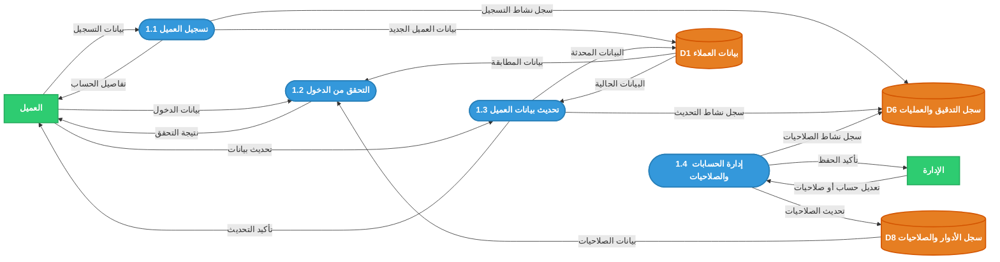

## 4) المستوى الأول لعملية (2.0) إدارة منتجات التأمين وقواعد التسعير

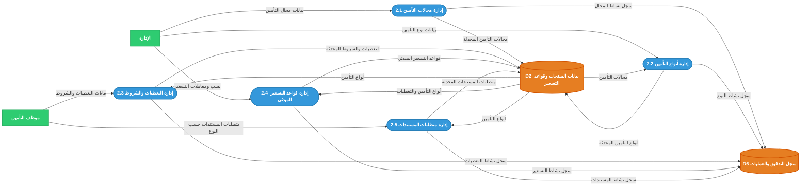

## 5) المستوى الأول لعملية (3.0) إدارة طلبات التأمين

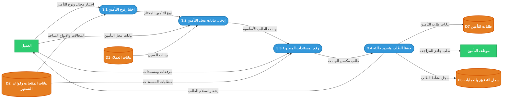

## 6) المستوى الأول لعملية (4.0) إدارة الاكتتاب والتسعير

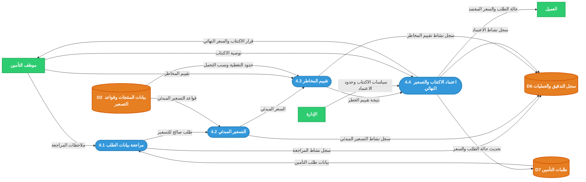

## 7) المستوى الأول لعملية (5.0) إدارة الوثائق التأمينية

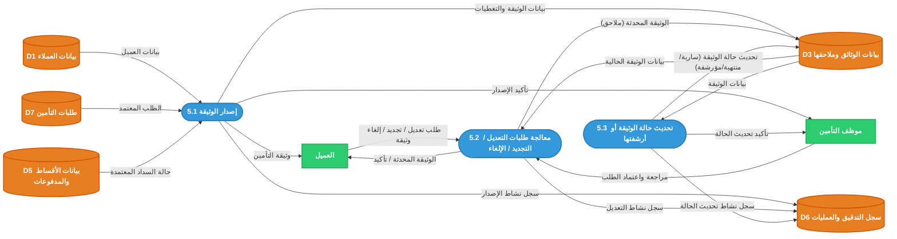

## 8) المستوى الأول لعملية (6.0) إدارة المطالبات التأمينية

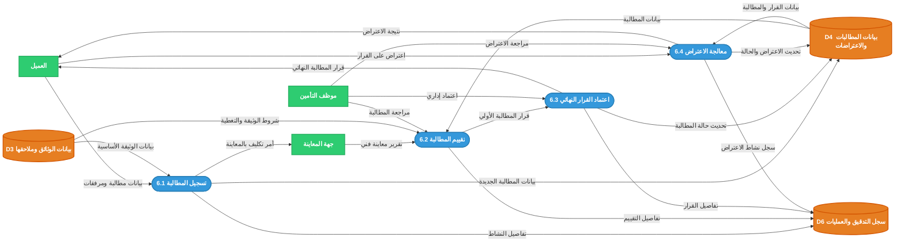

## 9) المستوى الأول لعملية (7.0) إدارة الأقساط والمدفوعات

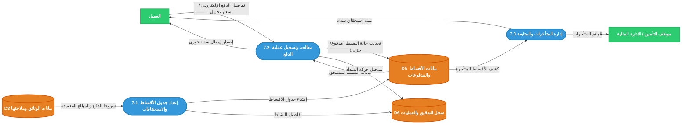

## 10) المستوى الأول لعملية (8.0) إدارة الإشعارات والتواصل

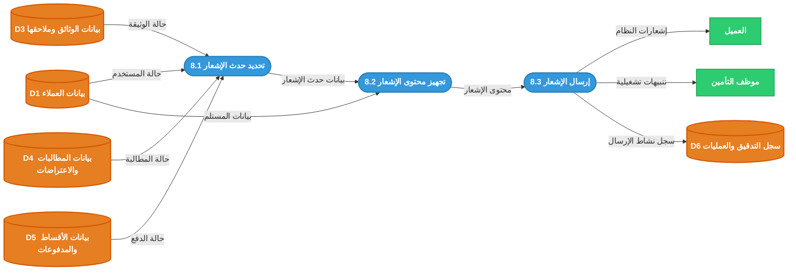

## 11) المستوى الأول لعملية (9.0) إدارة التقارير والتدقيق

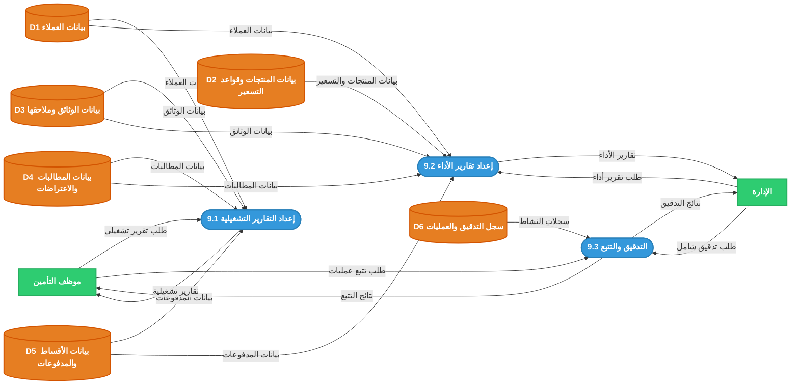

## ملاحظات الاتساق

1. تم اعتماد `1.0 إدارة العملاء والحسابات` كأول عملية لأنها تمثل نقطة الدخول للنظام وإدارة الحسابات والصلاحيات.
2. تم وضع `2.0 إدارة منتجات التأمين وقواعد التسعير` قبل الطلبات، لأن مجالات التأمين وأنواعه والتغطيات وقواعد التسعير يجب أن تكون معرفة مسبقاً حتى يستطيع العميل إنشاء طلب صحيح.
3. تم فصل `3.0 إدارة طلبات التأمين` عن `4.0 إدارة الاكتتاب والتسعير` لأن الطلب يمثل جمع البيانات والمستندات، بينما الاكتتاب والتسعير يمثلان المراجعة الفنية واتخاذ القرار.
4. مخزن `D2 بيانات المنتجات وقواعد التسعير` يشمل مجالات التأمين، أنواعه، قواعد التسعير، حدود التغطية، نسب التحمل، ومتطلبات المستندات حسب نوع التأمين.
5. الإدارة تعتمد السياسات وقواعد التسعير وحدود الاعتماد، بينما يتولى موظف التأمين إدخال وتحديث البيانات التشغيلية مثل التغطيات ومتطلبات المستندات ضمن صلاحياته.
6. سجل العمليات يظهر في مخططات المستوى الأول، كما تظهر تغذيته المختصرة في المستوى الصفري حتى تكون عملية التقارير والتدقيق متوازنة مع مصادر السجلات.
