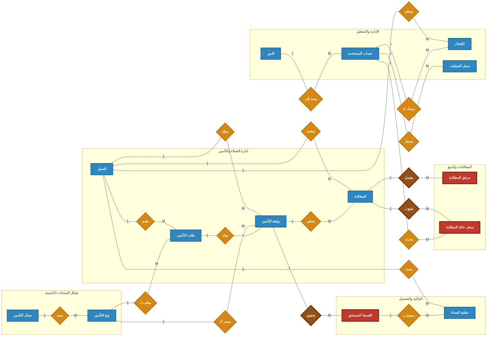
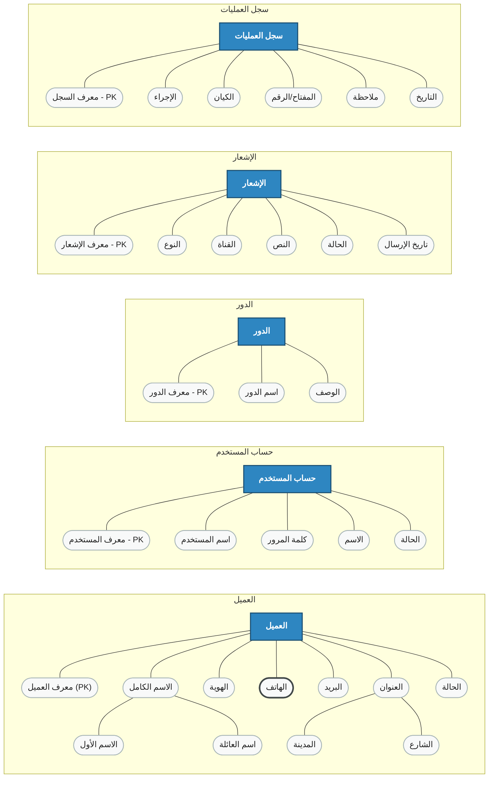
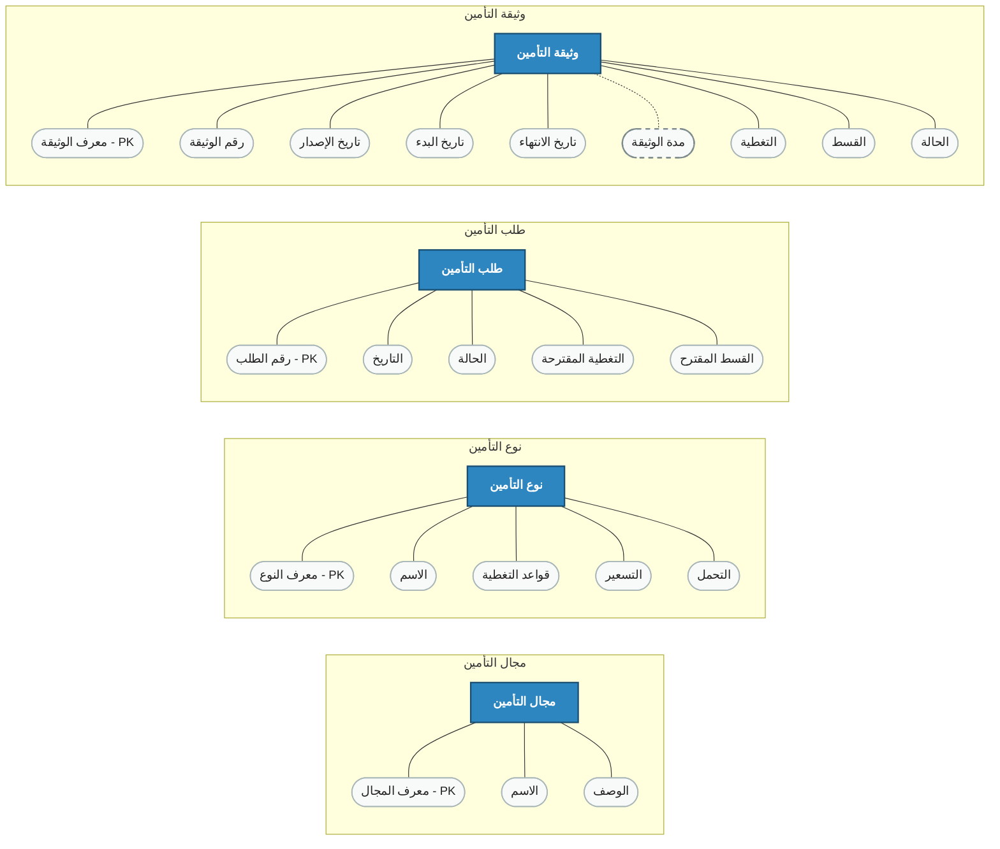
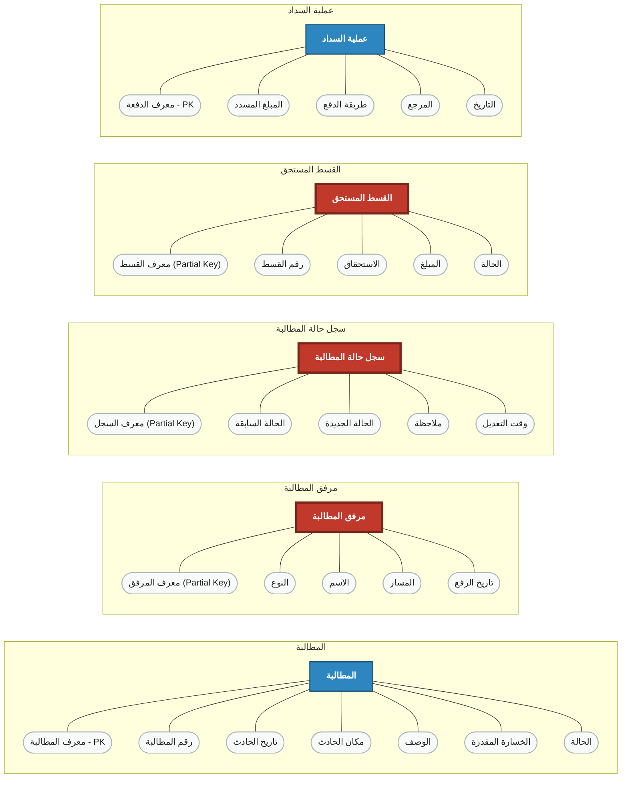

# مخطط الكينونة والعلاقة (Chen ERD) المنظم للطباعة والإدراج في Word

هذا الملف يعيد **تنظيم** نفس مخطط Chen ERD الموجود في الملف الأصلي، لكن بطريقة أكثر قابلية للقراءة والإدراج داخل مستند Word.

- لا يوجد أي حذف لأي كيان أو علاقة أو خاصية.
- تم فقط **إعادة توزيع المخطط** إلى:
  1. لوحة رئيسية للعلاقات بين الكيانات.
  2. لوحات تفصيلية للخصائص حسب المجال الوظيفي.
- هذا الأسلوب يعطي شكلاً أكاديمياً أنظف ويقلل المساحة البصرية المهدورة.

## دليل الرموز

- **الكيان القوي:** مستطيل أزرق.
- **الكيان الضعيف:** مستطيل أحمر بإطار سميك.
- **العلاقة العادية:** معين ذهبي.
- **العلاقة المُعرِّفة للكيان الضعيف:** معين بني داكن بإطار سميك.
- **الخاصية العادية:** شكل بيضاوي فاتح.
- **الخاصية متعددة القيم:** بيضاوي بإطار سميك.
- **الخاصية المشتقة:** بيضاوي بخط متقطع.
- **الخاصية المركبة:** خاصية رئيسية تتفرع إلى خصائص فرعية.

---

## 1) اللوحة الرئيسية: خريطة العلاقات بين الكيانات

---

## 2) لوحة الخصائص: العميل والحسابات الإدارية

---

## 3) لوحة الخصائص: المنتجات التأمينية ودورة الإصدار

---

## 4) لوحة الخصائص: المطالبات والسداد والتتبع

---

## 5) ملاحظات تنسيق مناسبة لملف Word

- عند إدراج المخطط في Word، استخدم كل لوحة كصورة مستقلة بدلاً من لقطة واحدة شديدة الاتساع.
- الأفضل وضع **اللوحة الرئيسية** أولاً، ثم اللوحات التفصيلية أسفلها كتفصيل مرجعي.
- هذا يمنحك شكلاً احترافياً قريباً من الرسومات الأكاديمية المنشورة، لكنه أوضح لأن العلاقات العامة منفصلة عن ازدحام الخصائص.

