# مخطط الكينونة والعلاقة (Chen ERD) المتقدم

يحتوي هذا الملف على المخطط التفصيلي لقاعدة البيانات الخاص بمنصة أمان لإدارة التأمينات باستخدام أسلوب (Chen Notation).

## 🎨 دليل الألوان والرموز الأكاديمية (Legend)
لفهم المخطط بشكل هندسي واحترافي، تم تطبيق المفاهيم وقواعد البيانات المتقدمة التالية وتمييزها بصرياً:

1. **الكيان القوي (Strong Entity) 🟦:** يعبر عنه بـ **(مستطيل أزرق)**. هو كيان مستقل له مفتاح أساسي خاص به (مثال: العميل، المطالبة).
2. **الكيان الضعيف (Weak Entity) 🟥:** يعبر عنه بـ **(مستطيل أحمر ذو إطار عريض)**. هو كيان لا يمكن أن يوجد إطلاقاً بدون كيان قوي أساسي يعتمد عليه (مثال: "القسط" لا يمكن أن يتواجد بدون "وثيقة").
3. **العلاقات (Relationships) 🟧:** يعبر عنها بـ **(معين أصفر/برتقالي)**. لتوضيح نوع وطبيعة الترابط بين الكيانات مثل (1 إلى M).
4. **العلاقات المُعرّفة (Identifying Relations) 🔴:** يعبر عنها بـ **(معين أحمر غامق ذو إطار عريض)**. وهي العلاقة المسؤولة عن ربط "الكيان الضعيف" بـ "الكيان القوي" الذي يعتمد عليه (مثل علاقة: "يحتوي" بين الوثيقة والقسط).
5. **الخصائص العادية والأولية ⚪:** أشكال بيضاوية بيضاء/رمادية لتمثيل الحقول (Attributes)، مع تمييز المفتاح الأساسي بكلمة `(PK)` والمفتاح الجزئي للكيان الضعيف بـ `(Partial Key)`.
6. **الصفات المركبة (Composite Attributes)  انقسام:** صفة تتفرع إلى صفات أخرى فرعية (لو راقبت خصائص العميل، ستجد `الاسم الكامل` يتفرع منه `الاسم الأول` و`اسم العائلة`).
7. **الصفات المشتقة (Derived Attributes) ➖➖:** صفة مرتبطة بـ **(خط متقطع)**. تعني أنها لا تُخزن كقيمة ثابتة في الداتا بيز بل تُحسب وقتياً (مثال: `مدة الوثيقة` يمكن استنتاجها من تواريخ البدء والانتهاء).
8. **الصفات متعددة القيم (Multivalued Attributes) 🔲:** صفة محاطة بـ **(إطار أسود عريض)** للدلالة على الإطار المزدوج. وهي تعني أن العميل الواحد قد يمتلك أكثر من قيمة لهذا الحقل (مثال: `الهاتف` يمكن للعميل امتلاك أرقام متعددة).

---

```mermaid
flowchart TD
    %% ======================= تصميم الألوان الأكاديمية (Legend CSS) =======================
    classDef entity fill:#3498DB,stroke:#2980B9,stroke-width:2px,color:#FFF,font-weight:bold
    classDef weak_entity fill:#E74C3C,stroke:#C0392B,stroke-width:4px,color:#FFF,font-weight:bold
    
    classDef attribute fill:#ECF0F1,stroke:#BDC3C7,stroke-width:1px,color:#333
    classDef multi_attribute fill:#ECF0F1,stroke:#2C3E50,stroke-width:3px,color:#333
    classDef derived_attribute fill:#ECF0F1,stroke:#95A5A6,stroke-width:2px,color:#333,stroke-dasharray: 6 6
    
    classDef relation fill:#F39C12,stroke:#E67E22,stroke-width:2px,color:#FFF,font-weight:bold
    classDef weak_relation fill:#D35400,stroke:#A04000,stroke-width:4px,color:#FFF,font-weight:bold

    %% ======================= الكيانات (قوية وضعيفة) =======================
    E_CLIENT["العميل"]:::entity
    E_USER["حساب المستخدم"]:::entity
    E_ROLE["الدور"]:::entity
    E_CAT["مجال التأمين"]:::entity
    E_TYPE["نوع التأمين"]:::entity
    E_REQ["طلب التأمين"]:::entity
    E_POL["وثيقة التأمين"]:::entity
    E_CLAIM["المطالبة"]:::entity
    E_PAY["عملية السداد"]:::entity
    E_NOTIF["الإشعار"]:::entity
    E_AUDIT["سجل العمليات"]:::entity
    
    %% كيانات ضعيفة (تعتمد على كيانات أخرى)
    E_CDOC["مرفق المطالبة"]:::weak_entity
    E_CSTAT["سجل حالة المطالبة"]:::weak_entity
    E_INST["القسط المستحق"]:::weak_entity

    %% ======================= العلاقات (عادية ومعرّفة للضعيف) =======================
    R_1{"يقدم"}:::relation
    R_2{"يملك"}:::relation
    R_3{"ينشئ"}:::relation
    R_4{"يسدد"}:::relation
    R_5{"يستلم"}:::relation
    R_6{"يضم"}:::relation
    R_7{"يطلب لـ"}:::relation
    R_8{"يصدر كـ"}:::relation
    R_9{"يولد"}:::relation
    R_11{"يسوى بـ"}:::relation
    R_12{"يغطي"}:::relation
    R_15{"يسند إلى"}:::relation
    R_16{"يسجل"}:::relation
    R_17{"يحدث"}:::relation
    R_18{"يرسل له"}:::relation

    %% علاقات مُعرِّفة للكيانات الضعيفة (Identifying Relationships)
    R_10{"يحتوي"}:::weak_relation
    R_13{"يشمل"}:::weak_relation
    R_14{"يتتبع بـ"}:::weak_relation

    %% ======================= الخصائص =======================
    %% العميل
    AL1(["معرف العميل (PK)"]):::attribute
    AL2(["الاسم الكامل"]):::attribute
    AL2A(["الاسم الأول"]):::attribute
    AL2B(["اسم العائلة"]):::attribute
    AL3(["الهوية"]):::attribute
    AL4(["الهاتف"]):::multi_attribute
    AL5(["البريد"]):::attribute
    AL6(["العنوان"]):::attribute
    AL6A(["المدينة"]):::attribute
    AL6B(["الشارع"]):::attribute
    AL7(["الحالة"]):::attribute

    %% المستخدم
    AU1(["معرف المستخدم - PK"]):::attribute
    AU2(["اسم المستخدم"]):::attribute
    AU3(["كلمة المرور"]):::attribute
    AU4(["الاسم"]):::attribute
    AU5(["الحالة"]):::attribute

    %% الدور
    AR1(["معرف الدور - PK"]):::attribute
    AR2(["اسم الدور"]):::attribute
    AR3(["الوصف"]):::attribute

    %% مجال التأمين
    AC1(["معرف المجال - PK"]):::attribute
    AC2(["الاسم"]):::attribute
    AC3(["الوصف"]):::attribute

    %% نوع التأمين
    AT1(["معرف النوع - PK"]):::attribute
    AT2(["الاسم"]):::attribute
    AT3(["قواعد التغطية"]):::attribute
    AT4(["التسعير"]):::attribute
    AT5(["التحمل"]):::attribute

    %% طلب التأمين
    AQ1(["رقم الطلب - PK"]):::attribute
    AQ2(["التاريخ"]):::attribute
    AQ3(["الحالة"]):::attribute
    AQ4(["التغطية المقترحة"]):::attribute
    AQ5(["القسط المقترح"]):::attribute

    %% الوثيقة
    AP1(["معرف الوثيقة - PK"]):::attribute
    AP2(["رقم الوثيقة"]):::attribute
    AP3(["تاريخ الإصدار"]):::attribute
    AP4(["تاريخ البدء"]):::attribute
    AP5(["تاريخ الانتهاء"]):::attribute
    AP_DERIVED(["مدة الوثيقة"]):::derived_attribute
    AP6(["التغطية"]):::attribute
    AP7(["القسط"]):::attribute
    AP8(["الحالة"]):::attribute

    %% المطالبة
    CL1(["معرف المطالبة - PK"]):::attribute
    CL2(["رقم المطالبة"]):::attribute
    CL3(["تاريخ الحادث"]):::attribute
    CL4(["مكان الحادث"]):::attribute
    CL5(["الوصف"]):::attribute
    CL6(["الخسارة المقدرة"]):::attribute
    CL7(["الحالة"]):::attribute

    %% مرفقات المطالبة (كيان ضعيف)
    DO1(["معرف المرفق (Partial Key)"]):::attribute
    DO2(["النوع"]):::attribute
    DO3(["الاسم"]):::attribute
    DO4(["المسار"]):::attribute
    DO5(["تاريخ الرفع"]):::attribute

    %% سجل حالة المطالبة (كيان ضعيف)
    CS1(["معرف السجل (Partial Key)"]):::attribute
    CS2(["الحالة السابقة"]):::attribute
    CS3(["الحالة الجديدة"]):::attribute
    CS4(["ملاحظة"]):::attribute
    CS5(["وقت التعديل"]):::attribute

    %% القسط المستحق (كيان ضعيف)
    IN1(["معرف القسط (Partial Key)"]):::attribute
    IN2(["رقم القسط"]):::attribute
    IN3(["الاستحقاق"]):::attribute
    IN4(["المبلغ"]):::attribute
    IN5(["الحالة"]):::attribute

    %% الدفعة
    PY1(["معرف الدفعة - PK"]):::attribute
    PY2(["المبلغ المسدد"]):::attribute
    PY3(["طريقة الدفع"]):::attribute
    PY4(["المرجع"]):::attribute
    PY5(["التاريخ"]):::attribute

    %% الإشعار
    NO1(["معرف الإشعار - PK"]):::attribute
    NO2(["النوع"]):::attribute
    NO3(["القناة"]):::attribute
    NO4(["النص"]):::attribute
    NO5(["الحالة"]):::attribute
    NO6(["تاريخ الإرسال"]):::attribute

    %% سجل العمليات
    AU_1(["معرف السجل - PK"]):::attribute
    AU_3(["الإجراء"]):::attribute
    AU_4(["الكيان"]):::attribute
    AU_5(["المفتاح/الرقم"]):::attribute
    AU_6(["ملاحظة"]):::attribute
    AU_7(["التاريخ"]):::attribute

    %% ======================= بناء علاقات الكيانات =======================
    
    E_CLIENT -- "1" --- R_1
    R_1 -- "M" --- E_REQ

    E_CLIENT -- "1" --- R_2
    R_2 -- "M" --- E_POL

    E_CLIENT -- "1" --- R_3
    R_3 -- "M" --- E_CLAIM

    E_CLIENT -- "1" --- R_4
    R_4 -- "M" --- E_PAY

    E_CLIENT -- "1" --- R_5
    R_5 -- "M" --- E_NOTIF

    E_CAT -- "1" --- R_6
    R_6 -- "M" --- E_TYPE

    E_TYPE -- "1" --- R_7
    R_7 -- "M" --- E_REQ

    E_TYPE -- "1" --- R_8
    R_8 -- "M" --- E_POL
    
    E_REQ -- "1" --- R_9
    R_9 -- "1" --- E_POL

    E_POL -- "1" --- R_10
    R_10 -- "M" --- E_INST

    E_INST -- "1" --- R_11
    R_11 -- "M" --- E_PAY

    E_POL -- "1" --- R_12
    R_12 -- "M" --- E_CLAIM

    E_CLAIM -- "1" --- R_13
    R_13 -- "M" --- E_CDOC

    E_CLAIM -- "1" --- R_14
    R_14 -- "M" --- E_CSTAT

    E_ROLE -- "1" --- R_15
    R_15 -- "M" --- E_USER

    E_USER -- "1" --- R_16
    R_16 -- "M" --- E_AUDIT

    E_USER -- "1" --- R_17
    R_17 -- "M" --- E_CSTAT

    E_USER -- "1" --- R_18
    R_18 -- "M" --- E_NOTIF

    %% ======================= بناء الروابط للخصائص =======================
    E_CLIENT --- AL1
    E_CLIENT --- AL2
    AL2 --- AL2A
    AL2 --- AL2B
    E_CLIENT --- AL3
    E_CLIENT --- AL4
    E_CLIENT --- AL5
    E_CLIENT --- AL6
    AL6 --- AL6A
    AL6 --- AL6B
    E_CLIENT --- AL7

    E_USER --- AU1
    E_USER --- AU2
    E_USER --- AU3
    E_USER --- AU4
    E_USER --- AU5

    E_ROLE --- AR1
    E_ROLE --- AR2
    E_ROLE --- AR3

    E_CAT --- AC1
    E_CAT --- AC2
    E_CAT --- AC3

    E_TYPE --- AT1
    E_TYPE --- AT2
    E_TYPE --- AT3
    E_TYPE --- AT4
    E_TYPE --- AT5

    E_REQ --- AQ1
    E_REQ --- AQ2
    E_REQ --- AQ3
    E_REQ --- AQ4
    E_REQ --- AQ5

    E_POL --- AP1
    E_POL --- AP2
    E_POL --- AP3
    E_POL --- AP4
    E_POL --- AP5
    E_POL -.- AP_DERIVED
    E_POL --- AP6
    E_POL --- AP7
    E_POL --- AP8

    E_CLAIM --- CL1
    E_CLAIM --- CL2
    E_CLAIM --- CL3
    E_CLAIM --- CL4
    E_CLAIM --- CL5
    E_CLAIM --- CL6
    E_CLAIM --- CL7

    E_CDOC --- DO1
    E_CDOC --- DO2
    E_CDOC --- DO3
    E_CDOC --- DO4
    E_CDOC --- DO5

    E_CSTAT --- CS1
    E_CSTAT --- CS2
    E_CSTAT --- CS3
    E_CSTAT --- CS4
    E_CSTAT --- CS5

    E_INST --- IN1
    E_INST --- IN2
    E_INST --- IN3
    E_INST --- IN4
    E_INST --- IN5

    E_PAY --- PY1
    E_PAY --- PY2
    E_PAY --- PY3
    E_PAY --- PY4
    E_PAY --- PY5

    E_NOTIF --- NO1
    E_NOTIF --- NO2
    E_NOTIF --- NO3
    E_NOTIF --- NO4
    E_NOTIF --- NO5
    E_NOTIF --- NO6

    E_AUDIT --- AU_1
    E_AUDIT --- AU_3
    E_AUDIT --- AU_4
    E_AUDIT --- AU_5
    E_AUDIT --- AU_6
    E_AUDIT --- AU_7
```

