# المخطط الصفري المبسط المصحح (Level 0 DFD)

تم إعداد هذه النسخة لتكون أوضح بصريًا وأكثر اتزانًا من النسخة السابقة، مع الإبقاء على العمليات الرئيسة والكيانات الخارجية ومخازن البيانات الأساسية فقط. وقد تم ترتيب العمليات حسب التسلسل المنطقي للنظام: العملاء والحسابات أولاً، ثم منتجات التأمين وقواعد التسعير، ثم طلبات التأمين، ثم الاكتتاب والتسعير، وبعدها الوثائق والمطالبات والمدفوعات والإشعارات والتقارير.

```mermaid
flowchart TB
    C["العميل"]
    E["موظف التأمين"]
    M["الإدارة"]
    B["البنك"]
    X["جهة المعاينة"]

    P1(["1.0 إدارة العملاء والحسابات"])
    P2(["2.0 إدارة منتجات التأمين وقواعد التسعير"])
    P3(["3.0 إدارة طلبات التأمين"])
    P4(["4.0 إدارة الاكتتاب والتسعير"])
    P5(["5.0 إدارة الوثائق"])
    P6(["6.0 إدارة المطالبات"])
    P7(["7.0 إدارة المدفوعات"])
    P8(["8.0 إدارة الإشعارات والتواصل"])
    P9(["9.0 إدارة التقارير والتدقيق"])

    %% ترتيب العمليات لمنع التداخل البصري (Grid Layout)
    P1 ~~~ P2 ~~~ P3
    P4 ~~~ P5 ~~~ P6
    P7 ~~~ P8 ~~~ P9

    D1[("D1 بيانات العملاء")]
    D2[("D2 بيانات المنتجات وقواعد التسعير")]
    D3[("D3 بيانات الوثائق")]
    D4[("D4 بيانات المطالبات")]
    D5[("D5 بيانات المدفوعات")]
    D6[("D6 سجل العمليات")]
    D7[("D7 طلبات التأمين")]
    D8[("D8 بيانات الصلاحيات")]

    %% الجهات الخارجية والعمليات الرئيسة
    C -->|"بيانات التسجيل والدخول"| P1
    M -->|"ضوابط المستخدمين والصلاحيات"| P1
    P1 -->|"بيانات الحساب"| C
    P1 -->|"تأكيد الإجراء"| M

    M -->|"بيانات المجالات والأنواع وقواعد التسعير"| P2
    E -->|"تحديثات المنتجات والتغطيات"| P2
    P2 -->|"قائمة المنتجات والتغطيات المتاحة"| C
    P2 -->|"تأكيد تحديث المنتجات"| M

    C -->|"طلب تأمين وبيانات محل التأمين"| P3
    D2 -->|"أنواع التأمين ومتطلبات المستندات"| P3
    P3 -->|"حالة استلام الطلب"| C
    P3 -->|"طلب جاهز للمراجعة"| E

    E -->|"تقييم المخاطر وبيانات المراجعة"| P4
    M -->|"سياسات الاكتتاب وحدود الاعتماد"| P4
    P4 -->|"قرار الاكتتاب والتسعير النهائي"| E
    P4 -->|"حالة الطلب والسعر المعتمد"| C

    E -->|"طلب إصدار أو تعديل وثيقة"| P5
    P5 -->|"وثيقة التأمين"| C
    P5 -->|"تأكيد الإجراء"| E

    C -->|"بيانات المطالبة ومرفقاتها"| P6
    E -->|"بيانات مراجعة المطالبة"| P6
    P6 -->|"طلب معاينة"| X
    X -->|"تقرير المعاينة"| P6
    P6 -->|"قرار المطالبة النهائي"| C

    C -->|"تفاصيل الدفع"| P7
    P7 -->|"بيانات أمر الدفع الإلكتروني"| B
    B -->|"بيانات تأكيد الدفع"| P7
    P7 -->|"حالة الدفع أو إشعار السداد"| C

    P8 -->|"إشعارات النظام"| C
    P8 -->|"تنبيهات تشغيلية"| E

    M -->|"طلبات التقارير والتدقيق"| P9
    E -->|"طلبات التقارير التشغيلية"| P9
    P9 -->|"تقارير الأداء ونتائج التدقيق"| M
    P9 -->|"تقارير تشغيلية"| E

    %% مخازن البيانات الأساسية
    P1 -->|"بيانات العملاء المحدثة"| D1
    D1 -->|"بيانات العملاء"| P1
    P1 -->|"بيانات الصلاحيات المحدثة"| D8
    D8 -->|"بيانات الصلاحيات"| P1

    P2 -->|"بيانات المنتجات والقواعد المحدثة"| D2
    D2 -->|"بيانات المنتجات وقواعد التسعير"| P2

    D1 -->|"بيانات العميل"| P3
    P3 -->|"بيانات طلب التأمين"| D7
    D7 -->|"بيانات الطلب"| P3

    D2 -->|"قواعد التسعير والتغطيات"| P4
    D7 -->|"بيانات طلب التأمين"| P4
    P4 -->|"حالة الطلب والسعر النهائي"| D7

    D1 -->|"بيانات العميل"| P5
    D7 -->|"الطلب المعتمد"| P5
    P5 -->|"بيانات الوثيقة"| D3

    D3 -->|"بيانات الوثيقة"| P6
    D4 -->|"بيانات المطالبة"| P6
    P6 -->|"بيانات المطالبة المحدثة"| D4

    D3 -->|"شروط الدفع"| P7
    D5 -->|"بيانات الاستحقاق"| P7
    P7 -->|"بيانات السداد المحدثة"| D5

    D1 -->|"بيانات العملاء"| P8
    D3 -->|"حالات الوثائق"| P8
    D4 -->|"حالات المطالبات"| P8
    D5 -->|"حالات المدفوعات"| P8

    P1 -->|"سجلات نشاط الحسابات"| D6
    P2 -->|"سجلات نشاط المنتجات"| D6
    P3 -->|"سجلات نشاط الطلبات"| D6
    P4 -->|"سجلات نشاط الاكتتاب"| D6
    P5 -->|"سجلات نشاط الوثائق"| D6
    P6 -->|"سجلات نشاط المطالبات"| D6
    P7 -->|"سجلات نشاط المدفوعات"| D6
    P8 -->|"سجلات نشاط الإشعارات"| D6

    D1 -->|"بيانات العملاء"| P9
    D2 -->|"بيانات المنتجات والتسعير"| P9
    D3 -->|"بيانات الوثائق"| P9
    D4 -->|"بيانات المطالبات"| P9
    D5 -->|"بيانات المدفوعات"| P9
    D6 -->|"سجلات النشاط"| P9
```

