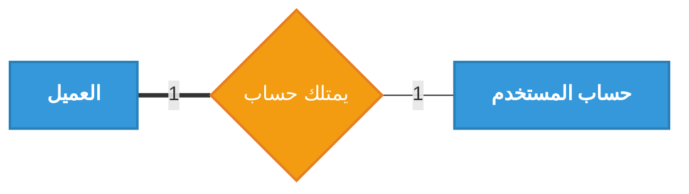
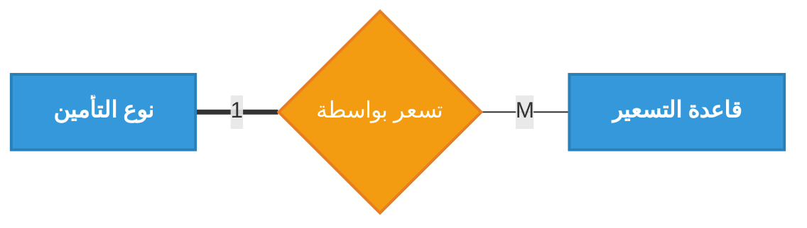

# تفصيل العلاقات في مخطط قواعد البيانات (ERD)

هذا الملف يحتوي على المخططات الجزئية باللغة العربية لجميع العلاقات الموجودة في مخطط الكينونة والعلاقة (Chen ERD)، مع تمييز الكيانات الضعيفة والعلاقات المعرّفة (Identifying Relationships). تم توحيد الترقيم هنا مع مخططات DFD الجديدة، لذلك تبدأ علاقات ERD من الشكل (3.12) بعد أشكال DFD التي تنتهي عند الشكل (3.11).

---

### التعليق للوورد: شكل (3.12): علاقة العميل بحساب المستخدم


---

### التعليق للوورد: شكل (3.13): علاقة العميل بطلب التأمين


---


### التعليق للوورد: شكل (3.14): علاقة العميل بالمطالبة


---

### التعليق للوورد: شكل (3.15): علاقة العميل بعملية السداد


---

### التعليق للوورد: شكل (3.16): علاقة العميل بالإشعارات


---

### التعليق للوورد: شكل (3.17): علاقة مجال التأمين بنوع التأمين


---

### التعليق للوورد: شكل (3.18): علاقة نوع التأمين بالطلبات


---

### التعليق للوورد: شكل (3.19): علاقة نوع التأمين بالتغطيات


---

### التعليق للوورد: شكل (3.20): علاقة نوع التأمين بقواعد التسعير


---

### التعليق للوورد: شكل (3.21): علاقة نوع التأمين بمتطلبات المستندات


---

### التعليق للوورد: شكل (3.22): علاقة قاعدة التسعير بطلب التأمين


---

### التعليق للوورد: شكل (3.23): علاقة نوع التأمين بالوثائق


---

### التعليق للوورد: شكل (3.24): علاقة الوثيقة بالتغطيات التأمينية


---

### التعليق للوورد: شكل (3.25): علاقة التبعية الضعيفة (الطلب ومرفقاته)


---

### التعليق للوورد: شكل (3.26): ارتباط الطلب بإصدار الوثيقة (1:1 مع مشاركة جزئية)


---

### التعليق للوورد: شكل (3.27): ارتباط الوثيقة والمطالبات


---

### التعليق للوورد: شكل (3.28): علاقة التبعية الضعيفة (الوثيقة والأقساط)


---

### التعليق للوورد: شكل (3.29): علاقة التبعية الضعيفة (المطالبة والمرفقات)


---

### التعليق للوورد: شكل (3.30): علاقة التبعية الضعيفة (المطالبة وسجل التتبع)


---

### التعليق للوورد: شكل (3.31): تسوية الأقساط بعمليات السداد


---

### التعليق للوورد: شكل (3.32): علاقة الدور بالصلاحيات
```mermaid
flowchart LR
    classDef entity fill:#3498DB,stroke:#2980B9,stroke-width:2px,color:#FFF,font-weight:bold
    classDef relation fill:#F39C12,stroke:#E67E22,stroke-width:2px,color:#FFF,shape:rhombus

    N1["الدور"]:::entity
    R1{"تمتلك"}:::relation
    N2["صلاحية النظام"]:::entity

    N1 ===|"M"| R1
    R1 ---|"N"| N2
```

---

### التعليق للوورد: شكل (3.33): ربط الأدوار والصلاحيات بالمستخدمين
```mermaid
flowchart LR
    classDef entity fill:#3498DB,stroke:#2980B9,stroke-width:2px,color:#FFF,font-weight:bold
    classDef relation fill:#F39C12,stroke:#E67E22,stroke-width:2px,color:#FFF,shape:rhombus

    N1["الدور"]:::entity
    R1{"يسند إلى"}:::relation
    N2["حساب المستخدم"]:::entity

    N1 ===|"1"| R1
    R1 ---|"M"| N2
```

---

### التعليق للوورد: شكل (3.34): علاقة المستخدم بسجل التدقيق والعمليات (Audit)
```mermaid
flowchart LR
    classDef entity fill:#3498DB,stroke:#2980B9,stroke-width:2px,color:#FFF,font-weight:bold
    classDef relation fill:#F39C12,stroke:#E67E22,stroke-width:2px,color:#FFF,shape:rhombus

    N1["حساب المستخدم"]:::entity
    R1{"يسجل"}:::relation
    N2["سجل التدقيق والعمليات"]:::entity

    N1 ===|"1"| R1
    R1 ---|"M"| N2
```

---

### التعليق للوورد: شكل (3.35): علاقة المستخدم (الموظف) بتحديث حالات المطالبات
```mermaid
flowchart LR
    classDef entity fill:#3498DB,stroke:#2980B9,stroke-width:2px,color:#FFF,font-weight:bold
    classDef weak_entity fill:#E74C3C,stroke:#C0392B,stroke-width:4px,color:#FFF,font-weight:bold
    classDef relation fill:#F39C12,stroke:#E67E22,stroke-width:2px,color:#FFF,shape:rhombus

    N1["حساب المستخدم"]:::entity
    R1{"يحدث"}:::relation
    N2["سجل حالة المطالبة"]:::weak_entity

    N1 ===|"1"| R1
    R1 ---|"M"| N2
```

---

### التعليق للوورد: شكل (3.36): علاقة المستخدم بالإشعارات الموجهة له
```mermaid
flowchart LR
    classDef entity fill:#3498DB,stroke:#2980B9,stroke-width:2px,color:#FFF,font-weight:bold
    classDef relation fill:#F39C12,stroke:#E67E22,stroke-width:2px,color:#FFF,shape:rhombus

    N1["حساب المستخدم"]:::entity
    R1{"يرسل له"}:::relation
    N2["الإشعار"]:::entity

    N1 ===|"1"| R1
    R1 ---|"M"| N2
```

---

### التعليق للوورد: شكل (3.37): علاقة المستخدم (موظف الاكتتاب) بمراجعة طلبات التأمين
```mermaid
flowchart LR
    classDef entity fill:#3498DB,stroke:#2980B9,stroke-width:2px,color:#FFF,font-weight:bold
    classDef relation fill:#F39C12,stroke:#E67E22,stroke-width:2px,color:#FFF,shape:rhombus

    N1["حساب المستخدم"]:::entity
    R1{"يراجع/يعتمد"}:::relation
    N2["طلب التأمين"]:::entity

    N1 ===|"1"| R1
    R1 ---|"M"| N2
```

### التعليق للوورد: شكل (3.38): علاقة التبعية الضعيفة (الوثيقة ومرفقاتها)
```mermaid
flowchart LR
    classDef entity fill:#3498DB,stroke:#2980B9,stroke-width:2px,color:#FFF,font-weight:bold
    classDef weak_entity fill:#E74C3C,stroke:#C0392B,stroke-width:4px,color:#FFF,font-weight:bold
    classDef weak_relation fill:#D35400,stroke:#A04000,stroke-width:4px,color:#FFF,shape:rhombus

    N1["وثيقة التأمين"]:::entity
    R1{"يرفق بـ"}:::weak_relation
    N2["مرفق الوثيقة"]:::weak_entity

    N1 ===|"1"| R1
    R1 ===|"M"| N2
```

---

### التعليق للوورد: شكل (3.39): علاقة التبعية الضعيفة (الوثيقة والملاحق)
```mermaid
flowchart LR
    classDef entity fill:#3498DB,stroke:#2980B9,stroke-width:2px,color:#FFF,font-weight:bold
    classDef weak_entity fill:#E74C3C,stroke:#C0392B,stroke-width:4px,color:#FFF,font-weight:bold
    classDef weak_relation fill:#D35400,stroke:#A04000,stroke-width:4px,color:#FFF,shape:rhombus

    N1["وثيقة التأمين"]:::entity
    R1{"يُعدّل بـ"}:::weak_relation
    N2["ملحق الوثيقة"]:::weak_entity

    N1 ===|"1"| R1
    R1 ===|"M"| N2
```

---

### التعليق للوورد: شكل (3.40): علاقة التبعية الضعيفة (المطالبة والاعتراضات)
```mermaid
flowchart LR
    classDef entity fill:#3498DB,stroke:#2980B9,stroke-width:2px,color:#FFF,font-weight:bold
    classDef weak_entity fill:#E74C3C,stroke:#C0392B,stroke-width:4px,color:#FFF,font-weight:bold
    classDef weak_relation fill:#D35400,stroke:#A04000,stroke-width:4px,color:#FFF,shape:rhombus

    N1["المطالبة"]:::entity
    R1{"يعترض على"}:::weak_relation
    N2["اعتراض المطالبة"]:::weak_entity

    N1 ===|"1"| R1
    R1 ===|"M"| N2
```

---

### التعليق للوورد: شكل (3.41): علاقة المستخدم بمعالجة اعتراضات المطالبات
```mermaid
flowchart LR
    classDef entity fill:#3498DB,stroke:#2980B9,stroke-width:2px,color:#FFF,font-weight:bold
    classDef weak_entity fill:#E74C3C,stroke:#C0392B,stroke-width:4px,color:#FFF,font-weight:bold
    classDef relation fill:#F39C12,stroke:#E67E22,stroke-width:2px,color:#FFF,shape:rhombus

    N1["حساب المستخدم"]:::entity
    R1{"يعالج"}:::relation
    N2["اعتراض المطالبة"]:::weak_entity

    N1 ===|"1"| R1
    R1 ---|"M"| N2
```
