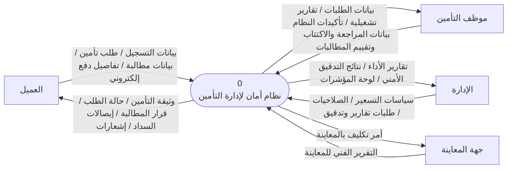
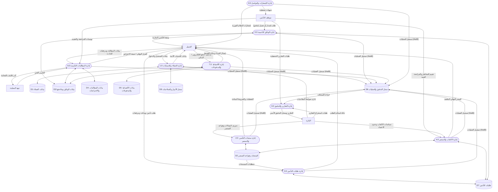
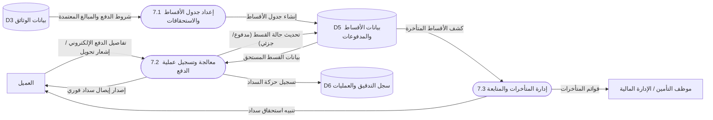

# تقرير التحليل والمطابقة الشامل لمخططات DFD مع المتطلبات النهائية
**تاريخ التقرير:** مايو 2026
**الهدف:** إجراء تدقيق هندسي وأكاديمي شامل لمخططات تدفق البيانات (DFD) ومطابقتها مع "المتطلبات الوظيفية وغير الوظيفية المحدثة" (نسخة Enterprise-grade)، وتنفيذ التعديلات الأكاديمية المطلوبة من لجنة المناقشة (إزالة كيان البنك).

---

## 1. التقييم الهندسي والأكاديمي (Overview)

بشكل عام، هندسة النظام في المخططات الحالية **قوية جداً وممتازة**، حيث تعتمد على تقسيم منطقي متسلسل (9 عمليات رئيسية) يعكس بدورة حياة التأمين الحقيقية. التطابق بين المتطلبات الوظيفية (Functional Requirements) وعمليات الـ DFD يكاد يكون **100% (One-to-One Mapping)**، وهو ما يعتبر نقطة قوة هائلة في مناقشة مشاريع التخرج.

ومع ذلك، للوصول إلى درجة "الكمال الأكاديمي" وتلبية ملاحظات الدكتور، قمنا باستخراج الفجوات (Gaps) وإعداد الحلول المباشرة لها:

---

## 2. تحليل الفجوات والتعديلات المطلوبة (Gap Analysis)

### 🔴 الملاحظة الأولى والأهم: إزالة الكيان الخارجي "البنك" (Bank Entity)
**المبرر الأكاديمي للدكتور:** في هندسة النظم، الكيان الخارجي (External Entity) هو جهة تفاعلية ترسل بيانات ابتدائية أو تستقبل مخرجات نهائية ولها إرادة في النظام. "بوابات الدفع الإلكتروني" أو "البنوك" في النظم الحديثة تعتبر **أدوات أو واجهات برمجية (APIs)** تتم داخل العمليات (Processes) وليست كيانات مستقلة في مخطط تدفق البيانات البيئي أو الصفري.
**التعديل المطلوب:** 
- حذف كيان `البنك` من المخطط البيئي (Context Diagram)، المخطط الصفري (Level 0)، ومخطط المستوى الأول (Level 1 لعملية الدفع).
- يتم الاكتفاء بأن "العميل" يُدخل "تفاصيل الدفع الإلكتروني" إلى عملية "إدارة المدفوعات"، وتقوم العملية بإنشاء "إيصال سداد" وإعادته للعميل.

### 🟡 الملاحظة الثانية: سجل التدقيق الأمني (Audit Log)
**الوضع في المتطلبات:** ركزنا بقوة على مصطلح "سجل تدقيق أمني (Audit Log)" لأغراض الامتثال وعدم الحذف الفيزيائي.
**الوضع في الـ DFD:** مخزن البيانات يُسمى `D6 سجل العمليات`.
**التعديل المطلوب:** لغوياً وهندسياً، لربط المخططات بالمتطلبات، يفضل تعديل اسم المخزن إلى `D6 سجل التدقيق والعمليات (Audit Log)` ليتماشى مع مصطلحات الـ Enterprise.

### 🟡 الملاحظة الثالثة: نظام الحالات (State Machine) والملاحق
**الوضع في المتطلبات:** تحدثنا عن "نظام حالات معياري" (جديدة، قيد المراجعة، الخ) و"ملاحق الوثائق (Endorsements)" و"الاعتراضات (Appeals)".
**الوضع في الـ DFD:** العمليات الفرعية تدعم هذا (مثل عملية 5.3 وتحديث الحالة، وعملية 6.4 للاعتراض)، وهذا تطابق **ممتاز جداً**.
**التعديل المطلوب:** لا يتطلب تعديلاً هيكلياً، لكن سنقوم بتحديث نصوص التدفق (Data Flows) لتعكس هذه المصطلحات (مثال: السهم الراجع للعميل يكون "حالة المطالبة أو نتيجة الاعتراض").

### 🟢 الملاحظة الرابعة: تطابق الصلاحيات والأدوار (RBAC)
**الوضع في المتطلبات:** تقييد الصلاحيات الوظيفية بناءً على الأدوار.
**الوضع في الـ DFD:** وجود مخزن `D8 سجل الأدوار والصلاحيات` مرتبط بعملية إدارة الحسابات ويمد الإدارة بالصلاحيات. هذا تطابق **هندسي دقيق جداً** يحسب للمشروع.

### ⭐ الملاحظة الخامسة (تحسينات الدقة الشاملة):
1. **مسح البنك نصياً:** تم التأكد من مسح كلمة "البنك" من نص المخطط البيئي (لم يتبقَّ أي أثر للبنك لا في الرسم ولا في النص).
2. **طلبات العميل للوثائق:** تمت إضافة تدفق صريح يوضح أن العميل هو من يطلب "تعديل / تجديد / إلغاء" الوثيقة لعملية (5.0 إدارة الوثائق)، بدلاً من جعلها مقتصرة على الموظف.
3. **ارتباط الإصدار بالدفع:** تمت إضافة ارتباط صريح من مخزن المدفوعات (D5) إلى عملية إصدار الوثيقة (5.1) كشرط مسبق (حالة السداد المعتمدة) لضمان عدم إصدار أي وثيقة إلا بعد تأكيد الدفع.

---

## 3. التحديثات الجذرية على المخططات (DFD Updates)

بناءً على التحليل، إليك الأكواد المحدثة لمخططات الـ Mermaid والتي يجب استبدالها في ملف `chapter3_dfd.md`:

### 3.1 المخطط البيئي (Context Diagram) بعد حذف البنك
*تم حذف البنك، وأصبح تدفق الدفع يتم بين العميل والنظام مباشرة (إدخال بيانات دفع -> استلام إيصال).*

### 3.2 المخطط الصفري المعتمد (Level 0 DFD)
*تم إزالة البنك، وتعديل اسم D6 ليكون أكثر دقة، وتحديث التدفقات الخاصة بالدفع.*

### 3.4 المستوى الأول لعملية (7.0) إدارة المدفوعات (إعادة هندسة بعد حذف البنك)
*عملية الدفع تم دمجها برمجياً لتمثل منطق واجهة الدفع من داخل النظام.*

---

## 4. نصائح ذهبية للمناقشة (بناءً على هذه التعديلات)

إذا سألك الدكتور: **"لماذا لا يوجد بنك في مخططاتكم رغم أن العملاء يدفعون إلكترونياً؟"**
**الإجابة النموذجية القاضية:**
> "يا دكتور، بناءً على توجيهاتكم ومبادئ هندسة البرمجيات الحديثة، بوابات الدفع الإلكترونية (Payment Gateways) والبنوك تُعتبر واجهات برمجية (APIs) تُستدعى **برمجياً داخل العملية (Process)**، وليست كياناً خارجياً (External Entity) مستقلاً يمتلك إرادة ويبادر بإرسال بيانات للنظام. العميل هو من يبادر بتقديم تفاصيل الدفع للعملية (7.2)، والعملية تقوم بالتحقق عبر الـ API خلف الكواليس، ثم تصدر الإيصال للعميل. رسم البنك ككيان مستقل يخالف التجريد الصحيح لمخطط تدفق البيانات التأميني."

إذا سألك: **"كيف تضمنون عدم تلاعب الموظفين وحذف البيانات المالي والمطالبات؟"**
**الإجابة:**
> "لا يوجد في النظام أي عملية حذف فيزيائي (Hard Delete). جميع العمليات تعتمد على تحديث 'نظام الحالات' (State Machine) مثل تحويل الوثيقة إلى 'مؤرشفة' أو 'موقوفة'. بالإضافة إلى وجود مخزن البيانات `D6 سجل التدقيق والعمليات (Audit Log)` المربوط بجميع العمليات الـ 8 الرئيسية، والذي يسجل من قام بالعملية ومتى وماذا عُدل، ولا يمكن لأي موظف مسح هذا السجل."

---
**الخلاصة:**
مخططاتك الآن أصبحت متطابقة **حرفياً** مع المعايير المؤسسية (Enterprise-grade) ومع المتطلبات الوظيفية التي بنيناها. وتم إزالة البنك بذكاء برمجي لا يخل بوجود ميزة الدفع الإلكتروني.
